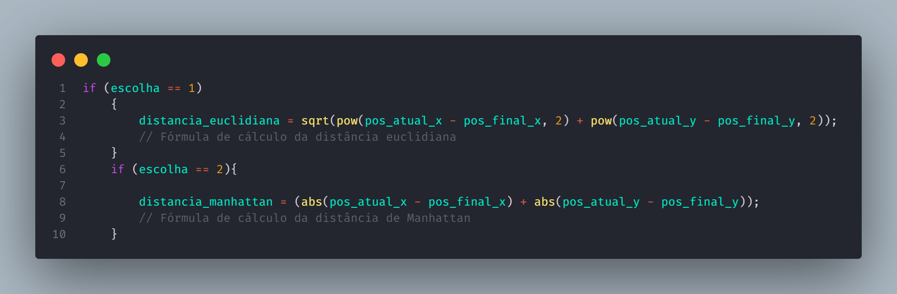
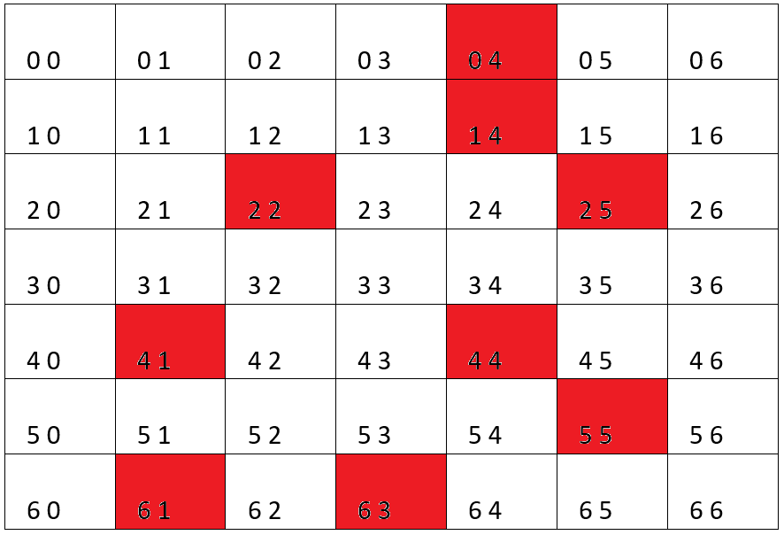
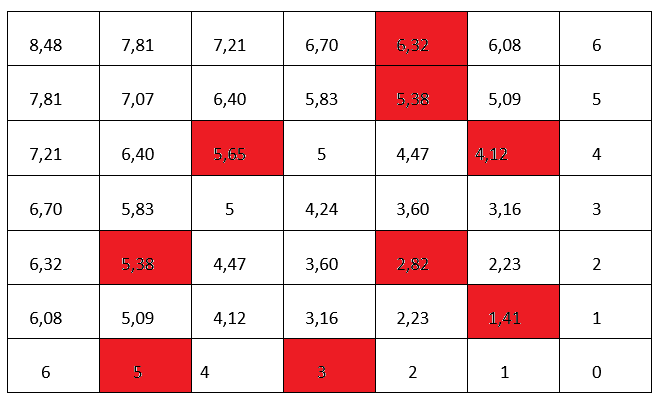
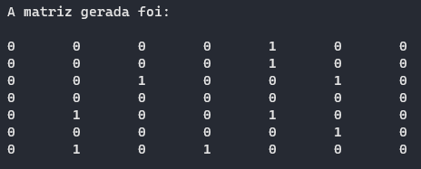
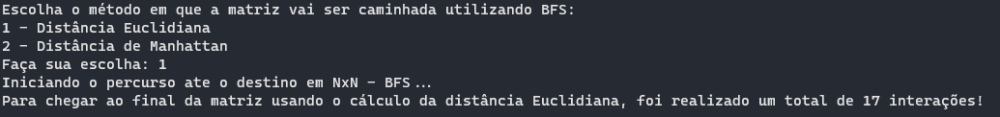
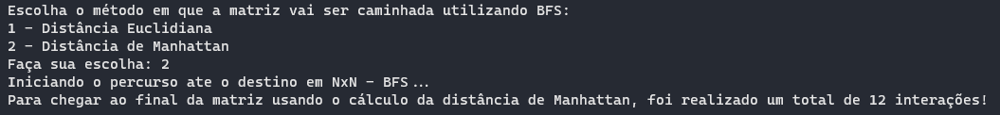
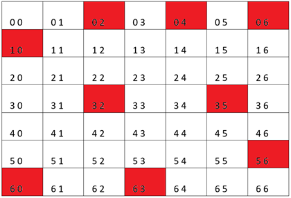
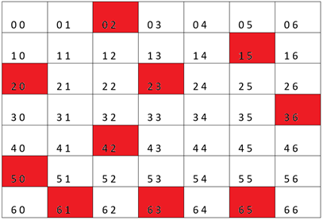
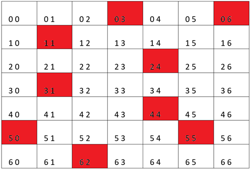

# Exercício de Tipo Abstrato de Dados Labirinto - BFS e DFS (Implementação do algoritmo A*)

<h1> Tipos diferentes de busca de caminhos utilizando o A*

## Conteúdos

 <a href="#apresentação">Apresentação</a> •
 <a href="#lógica">Lógica</a> • 
 <a href="#representação-gráfica">Representação gráfica</a> •
 <a href="#resultados">Resultados</a> • 
 <a href="#conclusão">Conclusão</a> • 
 <a href="#bibliotecas">Bibliotecas</a> •
 <a href="#compilação-e-execução">Compilação e Execução</a> • 
 <a href="#autores">Autores</a>

---

## Apresentação

Foi proposto pelo professor [Michel Pires da Silva](http://lattes.cnpq.br/1449902596670082) da matéria de `Arquitetura e Estruturas de Dados 1 do 3º Período do curso de Engenharia da Computação` no decorrer de suas aulas um problema no qual propunha um jogo em que é possível deslocar por dentro de uma determinada matriz até encontrar o *NxN* (sendo o último elemento) utilizando dois tipos diferentes de algoritmo de busca, sendo eles, `BFS (Busca em Largura controlada por Fila)` e `DFS(Busca em Profundidade controlada por Pilha)`, após a apresentação desses dois métodos e a prática de uma atividade avaliativa relacionada a eles, foi proposto uma outra atividade avaliativa em que se baseava em tornar o método de busca BFS em um algoritmo heurístico chamado de A*, onde feita determinadas comparações utilizando o algoritmo, era encontrada as distâncias euclidianas e __Manhattan__ e com isso feita as comparações, ao finalizar o caminho do labirinto, de suas diferentes velocidades para percorrer esse caminho. Segue uma breve explicação sobre o <a href="#•-algoritmo-a*">Algoritmo A*</a>: 

### • <u>Algoritmo A*</u>

O algoritmo A* é um dos mais utilizados em situações de <b>busca de caminhos</b> otimizando o método que deseja utilizar, tornando-o mais eficiente. 

✓ Utiliza a estrutura de dados *Fila*, por esse motivo, no programa desenvolvido foi utilizado somente no método BFS.

✓ Além de salvar os caminhos já calculados, ele utiliza <b>heurísticas</b> para verificar qual é a distância de cada ponto do ponto final com isso buscando o menor caminho pela menor distância

A <b>heurísticas</b> desse algoritmo baseia-se na tática utilizada para tomar determinadas decisões em sua execução, o algoritmo apresentado utiliza dois tipos de *heurísticas*, sendo elas a distância Euclidiana e a distância de Manhattan.

A <b><u>distância Euclidiana</u></b> consiste na utilização do <b>Teorema de Pitágoras</b> para descobrir a distância em linha reta do determinado ponto (posição atual) até o ponto final e utilizado pela seguinte fórmula:

$Distância = \sqrt{|x_1 - x_2|^2 + |y_1 - y_2|^2} $  ⇢ <u>sendo $x_1$ e $y_1$ as posições atuais e $x_2$ e $y_2$ as posições finais que é igual a *N* por se tratar de uma matriz quadrada.</u>

A <b><u>distância de Manhattan</u></b> consiste no cálculo do valor da soma de quantos blocos faltam, na vertical e na horizontal, para chegar ao objetivo, sendo a distância de cada bloco dada pela fórmula: 

$Distância = |x_1 - x_2| + |y_1 - y_2|$  ⇢ <u>sendo $x_1$ e $y_1$ as posições atuais e $x_2$ e $y_2$ as posições finais que é igual a *N* por se tratar de uma matriz quadrada.</u>

Com base nas heurísticas apresentadas, nosso algoritmo `BFS` foi incrementado de forma a utiliza-las para o melhor caminhamento matricial, obtendo total êxito durante a execução, tornando possível à percepção dos diferentes comportamentos relativos à movimentação do BFS, dependendo de qual tipo de busca o usuário escolha fazer.

---

## Lógica

Ao se deparar com a proposta do problema citado na <a href="#apresentação">Apresentação</a> a dupla decidiu em utilizar apenas um programa principal no qual iria ler um arquivo com o nome de `matriz.txt` constituído pelo tamanho da matriz na primeira linha e a seguir a matriz contendo as demais paredes de bloqueio onde a partir disso vai ser feita a leitura e então irá ser apresentado um menu ao usuário, que deverá escolher sobre qual método utilizar, caso o usuário informe **2**, será fornecido ao usuário o método de busca de caminho `DFS` que consiste no *Depth First Search* utilizando a *Estrutura de dados Pilha*, caso seja informado o número **1** como opção de escolha, o usuário será redirecionado ao método `BFS` que consiste no *Breadth First Search* utilizando a *Estrutura de dados Fila* onde será fornecido um novo menu em que irá mostrar mais duas novas opções de escolha em que o usuário irá escolher qual será a heurística utilizada para ser feito o cálculo da distância dos determinados pontos da matriz utilizando o método de busca BFS onde **1** será a heurística utilizando a <b>distância Euclidiana</b> e **2** será a heurística utilizando a <b>distância de Manhattan</b>, essa escolha vai ser armazenada em uma variável chamada _escolha_ onde será utilizada como parâmetro na nova função __Busca_A__ que retorna **booleana**, essa nova função será a função em que será feito o cálculo das heurísticas e de acordo com a valor armazenado variável _escolha_, será feito um tratamento de decisão onde irá redirecionar para o cálculo da escolha feita no menu anterior como por exemplo o código a seguir: 

 

Após o cálculo da determinada heurística, sendo ela de Manhattan ou Euclidiana, é feito um tratamento de exceção para caso seja a primeira posição, onde o __x__ (posição do eixo x) e __y__ (posição do eixo y) são 0 e 0 respectivamente, sendo apenas herdado o valor do cálculo da distância ( de acordo com as fórmulas apresentadas na <a href="#apresentação">Apresentação</a>) para uma variável auxiliar chamada _aux.distancia_ que será usada para enfileirar a distância dentro da fila e retorna a função de busca como valor *true*. Caso não seja a primeira vez que está sendo feito a busca, a função irá direcionar para uma lógica quase parecida com a citada anterior, mas agora irá ser direcionada após isso para uma função chamada __OrdenaFila__ em que retorna a fila e usa a lógica explicada a seguir.

Para realizar a ordenação da fila, foi escolhido um método pouco convencional por seu alto custo computacional, porém, prático e de fácil entendimento/implementação. O funcionamento de tal método pode ser descrito conforme os seguintes passos:
<ul>
    <li> Todo conteúdo da fila é transferido para um vetor auxiliar externo.</li>
    <li> O vetor é ordenado utilizando o clássico <i>Bubble Sort</i> ou Método da bolha.</li>
    <li> O conteúdo do vetor, uma vez já ordenado, é devolvido para a fila, tendo assim, uma fila ordenada.</li>
</ul>
Com a fila devidamente ordenada, é esperado que o algoritmo realize uma comparação do valor referente a distância da próxima posição que ele deve avançar com a última posição já presente na fila. Caso seja determinado que a próxima posição se encontra mais perto do destino em NxN, o algoritmo deve realizar o passo para a próxima posição, enfileirando assim sua nova localização e desenfileirando a que deixou de ser a mais próxima.

### • Alterações feitas na função do método BFS

De modos gerais, não houve <b>NENHUMA</b> alteração na lógica do algoritmo de busca BFS. Para a implementação das heurísticas, foi necessário apenas a adição de uma estrutura `IF` que, a cada enfileiramento, aciona a função __Busca_A__ e verifica se seu retorno é equivalente a **TRUE**, o que significa que a próxima posição possui valor de distância menor ao da posição atual, quando comparadas ao destino em NxN. Caso a função retorne um valor **FALSE**, o que significa que foi encontrado um valor de distância maior da posição anterior, será herdado a aquela posição da matriz o valor *1*, deixando-a inacessível para que não ocorra uma tentativa de desenfileirando mais a frente dessa posição.

---

## Representação gráfica

Segue a representação gráfica dos dois diferentes tipos de heurística (*Manhattan e Euclidiana*), onde foram representadas utilizando uma matriz dada como exemplo pelo professor citado:
 
 • *Os número que estão dentro de cada celula  da __Figura 1__ representam respectivamente a posição do **i** e a posição do **j**, para que não haja confusão, onde ache que seja o valor de alguma heurística*

 
<i><b>Figura 1: </b>Representação gráfica de uma matriz onde o A* Manhattan apresentará seu melhor desempenho em Nº de interações.</i>

• Segue abaixo os valores representados em cada célula onde foram obtidos utilizando os dois tipos de heurísticas, distância __Euclidiana__ e de __Manhattan__, respectivamentes, para a matriz informada acima:

 
<i><b>Figura 2: </b>Representação dos valores obtidos utilizando a fórmula da distância Euclidiana</i>

 
<i><b>Figura 3: </b>Representação dos valores obtidos utilizando a fórmula da distância de Manhattan</i>

---

## Resultados

• Com a obtenção do êxito para a proposta dada pelo professor, foi possível obter os seguintes resultados, onde todos são expressos através da saída obtida pelo programa feito pela dupla demonstrados nas seguintes figuras:

 
<i><b>Figura 4: </b>Representação do caminho da matriz retornada pelo programa feito</i>

Através dessa matriz feita pelo programa e a escolha da heurística para o cálculo da distância __Euclidiana__ e de __Manhattan__, foi obtido os seguintes resultados, sendo expressados pelo número de interações, ou seja, a quantidade de passos obtidos para que fosse possível chegar ao final:

 
<i><b>Figura 5: </b>Representação da quantidade interações retornadas pelo programa ao utilizar o cálculo da distância Euclidiana </i>

 
<i><b>Figura 6: </b>Representação da quantidade interações retornadas pelo programa ao utilizar o cálculo da distância de Manhattan </i>

Com esses resultados, onde foi observado as diferenças entre o número de interações da distância __Euclidiana__ e de __Manhattan__, foi possível observar que para o exemplo utilizado em todo o processo de conclusão, a heurística utilizada para a distância de Manhattan possui melhor desempenho nesse caso, obtendo a seguinte <a href="#conclusão">conclusão</a>.

---

## Conclusão

Após a realização de "N" testes, foi possível chegar a seguinte conclusão:

• Para matrizes que possuem obstáculos em suas bordas, com a exemplificada na *Figura 1* acima, o método de busca `BFS` utilizando a heurística da distância de __Manhattan__ apresentará um tempo de execução e número relativo de interações superior quando comparada ao outro tipo de heurística, sendo a distância __Euclidiana__.

Com uma determinada analise e diversos testes foi possível observar que existindo uma matriz com os respectivos obstáculos visíveis na *Figura 4* abaixo, existiria um pior caso para a utilização da heurística da distância de __Manhattan__:

 
<i><b>Figura 7: </b>Representação gráfica de uma matriz onde o A* Manhattan apresentará seu pior desempenho em Nº de interações</i>

Isso ocorre pelo modelo de busca utilizado pelo __Manhattan__ que, se comportando com um algoritmo guloso, caminhará pelas bordas, visando as posições que possuem menores distâncias.
Com tudo, é certo afirmar que, para matrizes que possuem barreiras espalhadas pelo seu centro, longe das bordas, o método de busca `BFS` ao utilizar a heurística da distância __Euclidiana__ apresentará um tempo de execução e número relativamente superior de interações quando comparada a distância de __Manhattan__, uma vez que prioriza o caminhamento da matriz utilizando da diagonal principal para atingir o objetivo em *NxN*. Por conta disso, obstáculos que obstruem a diagonal principal da matriz e suas posições vizinhas, influenciam completamente no número de interações realizadas pelo algoritmo.

• A seguir, são demonstradas duas matrizes respectivamente na *Figura 8* e *Figura 9*, onde é possível visualizar que os obstáculos presentes nas posições mostradas, ocasionam no melhor caso de utilização da heurística da distância __Euclidiana__ obtendo um melhor desempenho e obstáculos presentes também que mostram a pior situação de utilização da distância __Euclidiana__:

 
<i><b>Figura 8: </b>Representação gráfica de uma matriz onde o A* distância Euclidiana apresentará seu melhor desempenho em Nº de interações.</i>

 
<i><b>Figura 9: </b>Representação gráfica de uma matriz onde o A* distância Euclidiana apresentará seu pior desempenho em Nº de interações</i>

---

## Bibliotecas

Para o funcionamento do programa, é necessário incluir as seguintes bibliotecas: 
<ul>
    <li><code>#include 'stdlib.h'</code></li>
    <li><code>#include 'stdio.h'</code></li>
    <li><code>#include 'stdbool.h'</code></li>
</ul>

---

## Compilação e Execução

O programa feito de acordo com a proposta possui um arquivo Makefile que realiza todo o procedimento de compilação e execução. Para tanto, temos as seguintes diretrizes de execução:

| Comando                |  Função                                                                                           |                     
| -----------------------| ------------------------------------------------------------------------------------------------- |
|  `make clean`          | Apaga a última compilação realizada contida na pasta build                                        |
|  `make`                | Executa a compilação do programa utilizando o gcc, e o resultado vai para a pasta build           |
|  `make run`            | Executa o programa da pasta build após a realização da compilação             

---

## Autores

Criado por [Henrique Souza Fagundes](https://github.com/ohenriquesouza) em conjunto com [Pedro Henrique Louback Campos](https://github.com/PedroLouback) 

Ambos alunos do 3° periodo do curso de `Engenharia da Computação` no [CEFET-MG](https://www.cefetmg.br)
